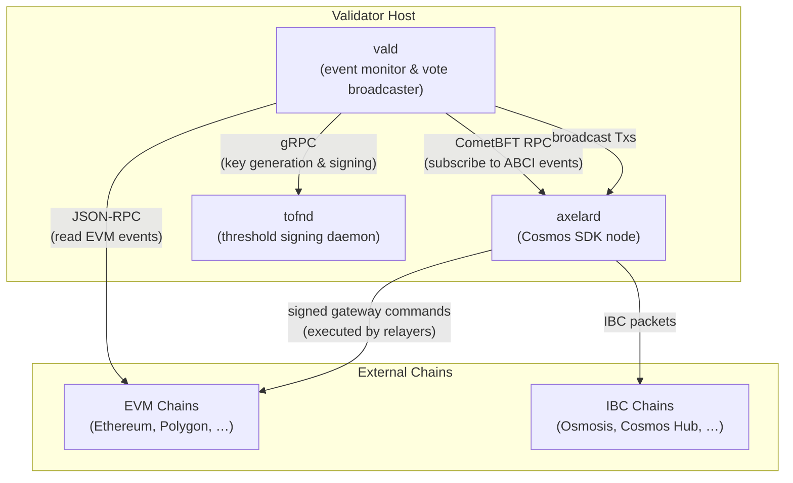
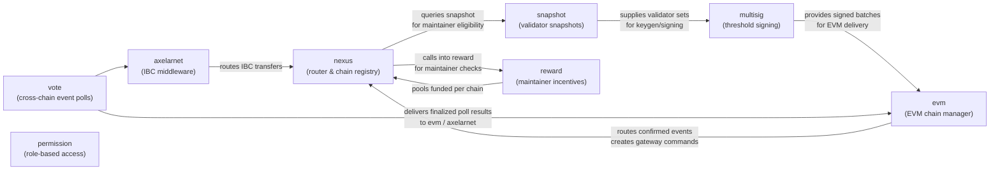
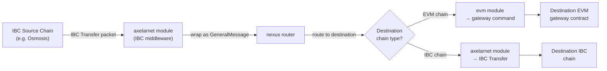

Axelar Core is composed of three cooperating processes — the `axelard` blockchain node, the `vald` event-monitoring sidecar, and the `tofnd` threshold-signing daemon — layered on top of the Cosmos SDK, CometBFT consensus, IBC, and CosmWasm. Understanding how these pieces fit together is essential for anyone operating a validator node, contributing to the protocol, or auditing how a cross-chain message travels from a user's wallet on one chain to a smart contract on another.

## High-Level Component Topology

The diagram below shows the three processes every Axelar validator runs and the external systems they communicate with.



### axelard

`axelard` is the primary binary produced by this repository. It is a full Cosmos SDK application that:

- Runs CometBFT consensus with the rest of the validator set.
- Applies all state transitions defined by Axelar's custom modules (nexus, evm, axelarnet, multisig, etc.) plus the standard Cosmos SDK modules.
- Exposes a CometBFT RPC endpoint (port `26657`), a Cosmos SDK gRPC endpoint (port `9090`), and a REST API (port `1317`).
- Accepts and routes inbound IBC packets via the IBC module stack.

### vald

`vald` (Validator Daemon) is a sidecar process that connects to a running `axelard` node via CometBFT's WebSocket RPC and subscribes to typed ABCI events. When it sees an event that requires off-chain action — such as a request to confirm a gateway transaction on an EVM chain or to participate in a multisig key-generation session — it performs that action and submits the result as a transaction back to `axelard`.

Key jobs managed by vald (from `vald/start.go`):

| Event Type | vald Handler |
|---|---|
| `evm.ChainAdded` | `evmMgr.ProcessNewChain` — registers a new EVM JSON-RPC connection |
| `evm.ConfirmGatewayTxsStarted` | `evmMgr.ProcessGatewayTxsConfirmation` — reads gateway tx receipts from EVM RPC |
| `evm.ConfirmTokenStarted` | `evmMgr.ProcessTokenConfirmation` — verifies ERC-20 deployment |
| `evm.ConfirmKeyTransferStarted` | `evmMgr.ProcessTransferKeyConfirmation` — verifies key-rotation tx |
| `multisig.KeygenStarted` | `multisigMgr.ProcessKeygenStarted` — participates in DKG via tofnd |
| `multisig.SigningStarted` | `multisigMgr.ProcessSigningStarted` — signs the command batch via tofnd |

### tofnd

`tofnd` is a separate, security-sensitive daemon that implements threshold multi-party computation (MPC) for key generation and signing. It communicates with `vald` exclusively over gRPC. The private key material never leaves `tofnd`; vald only sends signing requests and receives signature shares. This isolation means the validator's signing key is protected even if `vald` is compromised.

---

## Cosmos SDK Foundation

`axelard` is built on **Cosmos SDK v0.50** with **CometBFT** as the consensus engine. The standard modules included are:

- `auth`, `bank`, `staking`, `slashing`, `distribution`, `gov`, `mint` — core Cosmos SDK modules for account management, token issuance, proof-of-stake, and governance.
- `upgrade` — coordinated on-chain software upgrades.
- `evidence` — double-sign evidence handling.
- `feegrant` — fee delegation.
- `params` — on-chain parameter management.
- `crisis` — emergency network halt.

On top of these, `axelard` adds:

- **IBC v8** (`ibc-go`) — inter-blockchain communication protocol for IBC packet relay.
- **IBC Transfer** — the standard `transfer` module for fungible token transfers over IBC.
- **IBC Hooks** — middleware that allows IBC packets to trigger CosmWasm contract execution.
- **CosmWasm v0.54** (`wasmd`) — WebAssembly smart contract execution with capabilities: `iterator`, `staking`, `stargate`, `cosmwasm_1_1` through `cosmwasm_1_3`.

---

## Custom Module Dependency Graph

The Axelar-specific modules form a directed dependency graph. `nexus` sits at the center as the routing hub; all other modules depend on it rather than on each other.



### Module Roles

| Module | Role |
|---|---|
| **nexus** | Central routing table. Registers chains and assets, queues `GeneralMessage` objects, tracks chain maintainer vote records, and distributes queued messages each `EndBlock`. |
| **evm** | Manages EVM chain state: gateway bytecode, command batches, token deployments, key rotations. Translates confirmed EVM events into nexus messages and delivers inbound nexus messages as signed EVM commands. |
| **axelarnet** | IBC middleware and native asset handler. Wraps inbound IBC transfers as nexus-routable messages and sends outbound transfers over IBC to non-EVM chains. Manages deposit-address linking for asset transfers. |
| **multisig** | Threshold MPC coordination layer. Initiates keygen and signing sessions, collects validator signature shares (submitted by vald), and assembles completed threshold signatures for use by the evm module. |
| **snapshot** | Point-in-time validator-set snapshots with eligibility filtering (bonded status, active proxy). Consumed by multisig for session participant selection and by nexus for maintainer checks. |
| **vote** | On-chain poll mechanism. Validators cast typed votes; once a quorum threshold is reached the poll is finalized and its result dispatched to the registered handler (evm or axelarnet). |
| **permission** | Role-based access control enforced at the ante-handler level. Governance-assigned roles (e.g., `CHAIN_MANAGEMENT`) gate sensitive administrative messages without requiring a full governance proposal for every action. |
| **reward** | Per-chain reward pools. Funded by cross-chain transfer fees; distributed to chain maintainers proportional to correct vote participation. Underperforming maintainers have rewards cleared by nexus's `EndBlocker`. |

---

## Cross-Chain Message Lifecycle

The following diagram traces a General Message Passing (GMP) call from a user's dApp on an EVM source chain all the way to execution on an EVM destination chain.

```mermaid
sequenceDiagram
    participant User as User / dApp
    participant SrcGW as Source Gateway<br/>(EVM contract)
    participant Vald as vald sidecars<br/>(all validators)
    participant Chain as axelard<br/>(on-chain state)
    participant DstGW as Destination Gateway<br/>(EVM contract)
    participant DstContract as Destination Contract

    User->>SrcGW: callContract(destChain, destAddr, payload)
    SrcGW-->>SrcGW: emit ContractCall event

    Note over Vald: vald polls EVM RPC<br/>detects ContractCall log

    Vald->>Chain: MsgVoteEvents (cast vote on poll)
    Note over Chain: vote module accumulates votes;<br/>quorum reached → poll finalized

    Chain->>Chain: evm EndBlocker:<br/>confirmed event → nexus GeneralMessage

    Chain->>Chain: nexus EndBlocker:<br/>route message to destination chain queue

    Chain->>Chain: evm EndBlocker:<br/>GeneralMessage → ApproveContractCall command<br/>added to pending batch

    Chain->>Chain: multisig: signing session initiated<br/>snapshot selects validator participants

    Note over Vald: vald sees SigningStarted event;<br/>calls tofnd for threshold signature

    Vald->>Chain: MsgSubmitSignature (each validator)
    Note over Chain: multisig assembles threshold sig;<br/>batch status → SIGNED

    Note over DstGW: Off-chain relayer reads signed batch<br/>from axelard and submits to destination

    DstGW->>DstContract: execute(payload)
```

### Step-by-Step Breakdown

<Steps>
  <Step title="Source chain event emission">
    A user or protocol calls `callContract` (or `callContractWithToken`) on the source chain's Axelar gateway contract, emitting a `ContractCall` event with the destination chain, destination address, and ABI-encoded payload.
  </Step>

  <Step title="EVM event detection by vald">
    Each validator's `vald` process monitors the source chain's EVM JSON-RPC endpoint. When the gateway transaction is finalized, vald reads the event log and submits a `MsgVoteEvents` transaction to `axelard`.
  </Step>

  <Step title="Vote poll finalization">
    The `vote` module accumulates votes from validators. Once the quorum threshold is reached, the poll is finalized and its result is delivered to the evm module's vote handler.
  </Step>

  <Step title="EVM EndBlocker — routing to nexus">
    At the end of the block, the evm module's `EndBlocker` processes confirmed events. A `ContractCall` event becomes a `GeneralMessage` in the nexus module's routing queue, addressed to the destination chain. This deferral ensures the last voter does not bear the gas cost of routing.
  </Step>

  <Step title="Nexus EndBlocker — message queuing">
    The nexus `EndBlocker` routes the queued `GeneralMessage` to the destination chain's delivery queue, enforcing per-chain `EndBlockerLimit` caps to bound computation per block.
  </Step>

  <Step title="EVM EndBlocker — command batch creation">
    On the destination chain's evm module, the `EndBlocker` picks up the incoming nexus message and creates an `ApproveContractCall` (or `ApproveContractCallWithMint` for token transfers) command, appended to the pending command batch for that chain.
  </Step>

  <Step title="Multisig signing session">
    The multisig module initiates a signing session for the command batch, referencing the current active key for the destination chain. The snapshot module provides the list of eligible signing participants.
  </Step>

  <Step title="vald threshold signing via tofnd">
    Each participating validator's vald process detects the `SigningStarted` event, forwards the signing request to its local `tofnd` daemon, receives its signature share, and submits `MsgSubmitSignature` to `axelard`.
  </Step>

  <Step title="Signature assembly and batch finalization">
    Once enough signature shares are collected (threshold satisfied), the multisig module assembles the complete threshold signature and marks the batch as `SIGNED`.
  </Step>

  <Step title="Relayer delivery to destination chain">
    An off-chain relayer (anyone can run one) reads the signed command batch from `axelard` and submits it to the destination gateway contract. The gateway verifies the threshold signature and calls `execute(payload)` on the destination contract.
  </Step>
</Steps>

---

## IBC Cross-Chain Message Flow

For IBC-connected Cosmos chains, the flow differs: instead of a signed gateway command batch, the axelarnet module sends an IBC `MsgTransfer` or a custom IBC packet directly to the destination chain.



---

## Consensus and Finality

Axelar uses **CometBFT** (formerly Tendermint Core) BFT consensus. Blocks are final as soon as they are committed — there are no probabilistic finality concerns as with Nakamoto-style chains. This property is critical for cross-chain security: vald waits for EVM-chain finality (using configurable finality overrides per chain) before casting a confirmation vote, but Axelar's own block finality is instant.

As of v1.3.0, **optimistic block execution** is enabled for improved throughput, and the default block time has dropped to ~1 second (from ~5 seconds), requiring corresponding parameter adjustments:

| Parameter | Old Default | New Default |
|---|---|---|
| `axelarnet.RouteTimeoutWindow` | 17,000 blocks | 85,000 blocks |
| `evm.VotingGracePeriod` | 3 blocks | 15 blocks |
| `evm.RevoteLockingPeriod` | 15 blocks | 75 blocks |
| `multisig.KeygenTimeout` | 10 blocks | 50 blocks |
| `multisig.SigningTimeout` | 10 blocks | 50 blocks |

---

## Frequently Asked Questions

<AccordionGroup>
  <Accordion title="Why does vald run as a separate process instead of inside axelard?">
    The vald sidecar needs access to external EVM RPC endpoints and to the `tofnd` signing daemon, both of which are off-chain resources. Keeping it separate from the consensus-critical `axelard` process means a crash or misconfiguration in vald cannot corrupt on-chain state. It also allows validators to apply different security boundaries (e.g., network ACLs) to each process.
  </Accordion>

  <Accordion title="What happens if vald misses a signing session?">
    If a validator fails to submit a signature share within the `SigningTimeout` window, the multisig module marks that participant as absent for that session. Repeated absences can cause the nexus module to de-register the validator as a chain maintainer and clear its pending rewards via the reward module.
  </Accordion>

  <Accordion title="How is the active signing key rotated on EVM chains?">
    Key rotation is triggered by a governance proposal or administrative message. The multisig module runs a new keygen session with the current validator snapshot, and the new key is registered with the evm module. vald then submits a transaction to the EVM gateway to transfer operatorship to the new key, which vald confirms on-chain once the EVM transaction is finalized.
  </Accordion>

  <Accordion title="Can anyone relay signed command batches, or is it permissioned?">
    Relaying is permissionless. Signed command batches are publicly readable from `axelard` via CLI or gRPC. Any party can submit them to the destination gateway contract. Axelar runs its own relayers, but the protocol does not depend on them — any third party can relay for liveness or MEV reasons.
  </Accordion>

  <Accordion title="What is the role of CosmWasm in Axelar Core?">
    CosmWasm enables Axelar to host smart contracts on the Axelar chain itself. These contracts can interact with the nexus gateway, query chain registration data, and participate in cross-chain message routing. The nexus gateway CosmWasm contract supports `CallContractWithToken` from v1.1.0 onwards. The supported CosmWasm capabilities are: `iterator`, `staking`, `stargate`, `cosmwasm_1_1`, `cosmwasm_1_2`, `cosmwasm_1_3`.
  </Accordion>
</AccordionGroup>

---

## Next Steps

<CardGroup cols={2}>
  <Card title="Quickstart" icon="rocket" href="./quickstart">
    Build the axelard binary and launch your first node.
  </Card>
  <Card title="Introduction" icon="book-open" href="./introduction">
    Review the full list of custom modules and target audiences.
  </Card>
</CardGroup>
